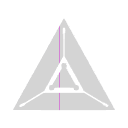

<p align="center">
  
</p>

<h1 align="center">Mornio</h1>

<p align="center"><strong>Make every new tab count.</strong></p>
<p align="center">Calmo e premium. Um novo começo a cada guia.</p>

---

Extensão de nova guia para Chrome/Edge/Brave: relógio grande, saudação personalizada, fusos horários, clima, favoritos, tarefas, notas e citação diária, com foto de fundo que muda todos os dias.

## Recursos

- **Relógio e saudação**: hora local em destaque e saudação com seu nome (Bom dia / Boa tarde / Boa noite), fonte Poppins.
- **Atalhos no topo**: Tarefas, Notas e Foto no canto superior esquerdo, com ícones brancos em estilo linha.
- **Fusos horários**: configuráveis nas Configurações; busque qualquer fuso IANA (ex.: Sao Paulo, Tokyo) e adicione/remova até 6 relógios. Padrão: Bogotá, Boston, Portugal e Londres.
- **Barra de favoritos**: exibe os favoritos reais do Chrome no topo, em estilo compacto como a barra nativa, com favicons e pastas em dropdown (incluindo subpastas). Pode ser ligada/desligada nas Configurações.
- **Clima**: temperatura atual da cidade configurada, via Open-Meteo (sem chave de API), com ícone por condição.
- **Tarefas**: painel lateral esquerdo com lista de tarefas (adicionar, concluir, remover).
- **Notas**: painel lateral direito com salvamento automático.
- **Citação diária**: frase motivacional em português que muda a cada dia; passe o mouse sobre a frase para trocar por outra.
- **Foto de fundo**: imagem cênica nova por dia (Lorem Picsum), com botão "Foto" para trocar na hora. Se estiver offline, usa um gradiente.
- **Configurações**: engrenagem no canto inferior esquerdo. Nome, cidade do clima (busca com autocomplete e resultados reais de geocodificação), relógios mundiais e barra de favoritos.
- **Efeitos**: entrada escalonada dos elementos, crossfade entre fotos de fundo com leve zoom (Ken Burns), painéis de vidro (blur + saturação), micro-interações de hover/press e transição suave na troca de frase. Tudo respeita `prefers-reduced-motion`.

Tudo é salvo localmente no navegador (localStorage). Nenhum dado sai da sua máquina, exceto as consultas de clima e as imagens de fundo.

## Como instalar

1. Clone este repositório:

```bash
git clone https://github.com/joaosouz4dev/mornio-extension.git
```

2. Abra `chrome://extensions` (ou `edge://extensions`).
3. Ative o **Modo do desenvolvedor** (canto superior direito).
4. Clique em **Carregar sem compactação** (Load unpacked).
5. Selecione a pasta clonada.
6. Abra uma nova guia.

> Na primeira nova guia, o Chrome pergunta se você quer manter a nova página. Clique em "Manter".

## Estrutura

```
mornio-extension/
├── manifest.json    # Manifest V3, override da nova guia
├── newtab.html      # Estrutura da página
├── css/style.css    # Estilos
├── js/app.js        # Lógica (relógio, clima, favoritos, tarefas, notas, etc.)
└── icons/           # Ícones da extensão (gerados de icons/logo.svg)
```
